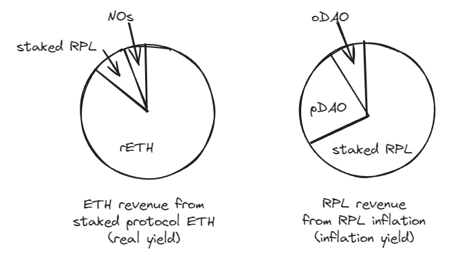
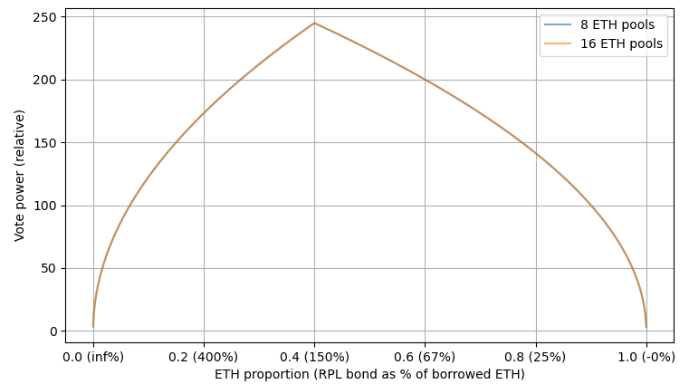

THIS SUBMISSION HAS BEEN RETRACTED IN FAVOR OF A SIMILAR ONE AT [direct_capture_2.md](direct_capture2.md)

## The general idea 
- Split up ETH commission to a component that goes to NOs and a component that goes to RPL stakers
  - Weight the RPL component per staked token
  - Note that RPL staking doesn't require minipools. This is technically the case now, but there's no reason to do it this way. 
- Remove the requirement of staking RPL in order to make minipools

## Getting numbers
Here I'll endeavor to get the system to work roughly "the same" as it currently does, especially at maturity.

Let's look at total ETH ROI under the current and proposed system. For the proposed system, we're only looking at the NO component (aka, not the RPL staking component at all). We then set them equal and solve for equivalent_commission.

- `ROI_current = (bonded_ETH + borrowed_ETH*commission)/(bonded_eth + min_RPL_as_pct_borrowed_eth*borrowed_eth)`
- `ROI_proposed = (bonded_ETH + borrowed_ETH*equivalent_commission)/bonded_eth`
- `equivalent_commission = (bonded_ETH * (commission - min_RPL_as_pct_borrowed_eth)) / (bonded_eth + min_RPL_as_pct_borrowed_eth*borrowed_eth)`
- `equivalent_commission = (8 * (.14 - .1)) / (8 + 2.4) = 0.0308`

This means we'd be "equivalent" if we sent 22% of commission revenue to NOs and the remaining 78% went to staked RPL.

Note that commission revenue now gets an explicit RPL weight dependency. My belief is that this already exists -- the required minimum captures value and gives it to all RPL (aka, token weighted), but it's very non-obvious. Currently we also have a split -- the "future value of commission" gets captured by RPL, but the current commission gets captured by NOs (a much smaller subset of RPL holders). See the [variations](#variations) section for some possible tweaks. 

## Valuation
At maturity, I think valuation is unchanged. We calculated the equivalent commission for the NO and RPL components and used that, so it should match.

## Thoughts
This completely switches RPL value capture mechanism. Rather than requiring it for minipools as a “ticket to commission” by allowing minipool creation, it is a direct ticket to commission revenue.

Pros:
- ETH-only minipools supported :)
- Simpler to explain value capture vs the indirect “minimum bond” requirement
- 1-2 fewer parties than the other ideas that enable ETH-only minipools
- Doesn’t break voting! See below

Cons:
- :rotating_light: This would give a _lot_ of the yield currently going to NOs to either RPL-heavy NOs or pure RPL stakers. :rotating_light:
  - This is not what we want to do (eg, as shown by the [RPIP-30](https://rpips.rocketpool.net/RPIPs/RPIP-30) vote), and instead we'd like to encourage minipool creation.
  - This problem goes away at maturity, but we are _not_ at maturity by a wide margin
- Pretty annoying for small RPL holders b/c value capture requires making a node, staking, claiming – lotsa gas
  - We may be able to mitigate this with an L2 that would allow RPL staking only (though ofc we’d need to get some RPL liquidity in that market now)
- We’d essentially be getting rid of RPL-as-collateral, since it’s not required. Right now, we don’t use it anyways (except in oddball megaslashing cases, where its utility is liquidity-limited). That said, it takes away our ability to have an “instant-speed” bond.
  - Might be able to mitigate with something like a rETH bond if seen as necessary
- 3.08% commission for NOs doesn't sound as sexy as 14% commission.

### Voting thoughts
Interestingly, it seems like our vote power formulation should survive this change as is. Since vote power can only be contributed for RPL up to 150% of bonded ETH, nodes that are very heavy RPL don’t break voting. Since RPL is needed, nodes that are very heavy ETH also don’t break voting. They _do_ get more vote per RPL, but less total vote. Assuming you want to maximize vote per capital (and don’t care about exposure or expect ratio changes), you would target 150% bonded ETH for your node. Fwiw, this model looks at every way you can spend 100k ETH on just one of 8/16 ETH minipools and the vote power that comes out of it.

### Variations
- See [direct_capture_2.md](direct_capture2.md) for my preferred variant (preferred over this one). This uses a modified version of RPIP-30's curve to most heavily reward RPL staking alongside rETH supply creation.
- Since we're now also giving _present_ commission to RPL, we could reduce their share. Eg, go with 50%-75% to NOs instead of the calculated 22%.
  - This could be ~dynamic based on market share updated every ~3 periods. For example, it could be 20% if we are at or above 15% market share, 90% if we are at or below 1%, and linearly interpolated in between. 
- We can provide a bonus to folks that do both RPL staking and Node Operation. As a rough example, we could provide double weight to RPL valued at 10% of borrowed ETH. This would help push rewards towards "create rETH supply", which is important for growth.
  - I like something along these thematically, but I think number selection is a challenge and it adds a knob.

