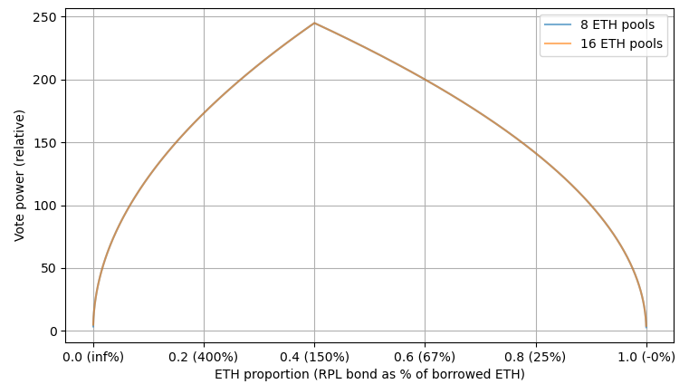

This idea is meant to address "Rapid Research Incubator" topic #2 and #1
  - #2 alternative value capture for RPL:
    - The bond is removed as a form of value capture
    - ETH commission to RPL is used for value capture
  - #1 by breaking the hard requirement that NOs be RPL stakers, the market is able to balance RPL staking attractiveness and NO attractiveness. When holding RPL isn't seen as attractive, people will prefer to stake without RPL. This will increase the commission share per RPL, which will make RPL more attractive. This works in reverse as well, wehere overattractive RPL causes staking and reduces commission share per RPL until it's no longer overattractive 

## The general idea 
- Split up ETH commission to a component that goes to NOs and a component that goes to RPL stakers
- The component that goes to RPL stakers will be done similar to current RPL rewards, where it goes to a vault and is claimable every reward period
- The component that goes to RPL stakers is socialized across all RPL stakers
- Make a new curve, somewhat similar to RPIP-30's that will be used for _both_ ETH commission and RPL rewards
  - 
- Remove the requirement of staking RPL in order to make minipools

## Getting numbers
Here I'll endeavor to get the system to work roughly "the same" as it currently does, especially at maturity.

Let's look at total ETH ROI under the current and proposed system. For the proposed system, we're only looking at the NO component (aka, not the RPL staking component at all). We then set them equal and solve for equivalent_commission.

- `ROI_current = solo_apy * (bonded_ETH + borrowed_ETH*commission)/(bonded_eth + min_RPL_as_pct_borrowed_eth*borrowed_eth)`
- `ROI_proposed = solo_apy * (bonded_ETH + borrowed_ETH*equivalent_commission)/bonded_eth`
- `equivalent_commission = (bonded_ETH * (commission - min_RPL_as_pct_borrowed_eth)) / (bonded_eth + min_RPL_as_pct_borrowed_eth*borrowed_eth)`
- `equivalent_commission = (8 * (.14 - .1)) / (8 + 2.4) = 0.0308`

This means we'd be "equivalent" if we sent 22% of commission revenue to NOs and the remaining 78% went to staked RPL.

This system is quite easy to explain vs the status quo. Essentially an ETH pie chart and an RPL pie chart:\

Another thing we could look at to determine commission split would be competitiveness.\
- Here we can look at the proposed Lido CSM ROI: `solo_apy * (4*0.9+32*0.075)/4 = 1.5 * solo_apy`
- To match that with LEB8s, we'd need NOs to get 119% of commission :stuck_out_tongue_winking_eye:
- To match that with LEB4s, we'd need NOs to get 51% of commission
- To match that with LEB3s, we'd need NOs to get 36.9% of commission
- To match that with LEB2s, we'd need NOs to get 23.8% of commission
- To match that with LEB1.5s, we'd need NOs to get 17.6% of commission

## Thoughts
This is a wholesale change in how RPL captures value. Rather than requiring it for minipools as a 'ticket to commission' by allowing minipool creation, it is a direct ticket to commission revenue.

- Based on the [Getting Numbers](#getting-numbers) section, if we set 22% of commission going to NOs it should keep valuation roughly the same. My initial instinct is that we should roughly match Lido CSM numbers, so we'll want to go higher than that on the split.
- I have suggested two main modifications from the RPIP-30 curve:
  - Start the linear ramp at 0% -- given the new value capture method, there is no longer a justification or reason to start at 10% or any other value. I think this is important.
  - End the linear region around 12%. My thought here is that, at maturity, we'd like folks to have incentives for a similar stake as in the current system. I am definitely not married to this -- it was the first thought about when it should get diminishing returns.
- By using a single curve for both ETH commission and RPL rewards, we are maximizing how opinionated we are about incentivizing the behavior embodied by the curve.

Pros:
- ETH-only minipools supported :)
- No reason for people to use anything but the most efficient offered minipool (lowest ETH bond). Might simplify the outward facing offering.
- Simpler to explain value capture vs the indirect “minimum bond” requirement
- Pretty simple to explain ETH and RPL apys
  - ETH is just a single APY number
  - RPL is one ETH APY number and one RPL APY number
    - To achieve "single number", this is just the linear part based on last period. Can have a slider to see what going further would've gotten you last period.
- This system allows staking massive amounts of RPL to get more commission -- just like in RPIP-30, this is unattractive at the extreme due to the diminishing returns in the curve
- 1-2 fewer parties than the other ideas that enable ETH-only minipools
- Works well with current voting; see [voting thoughts](#voting-thoughts)

Cons:
- We’d essentially be getting rid of RPL-as-collateral, since it’s not required. Right now, we don’t use it anyways (except in oddball megaslashing cases, where its utility is liquidity-limited). That said, it takes away our ability to have an “instant-speed” bond.
  - Might be able to mitigate with something like a rETH bond if seen as necessary
- 3.08% commission for NOs doesn't sound as sexy as 14% commission; this is mostly a communication problem, as it's indirectly the equivalent to the current situation with a minimum.

### Voting thoughts
Interestingly, it seems like our vote power formulation should survive this change as is. Since vote power can only be contributed for RPL up to 150% of bonded ETH, nodes that are very heavy RPL don’t break voting. Since RPL is needed, nodes that are very heavy ETH also don’t break voting. They _do_ get more vote per RPL, but less total vote. Assuming you want to maximize vote per capital (and don’t care about exposure or expect ratio changes), you would target 150% bonded ETH for your node. Fwiw, this model looks at every way you can spend 100k ETH on just one of 8/16 ETH minipools and the vote power that comes out of it.

## Acknowledgements
Thanks to samus and sckuzzle for helping me see that [direct_capture.md](direct_capture.md) really wasn't getting me to a place I liked and a good road to get somewhere happy.