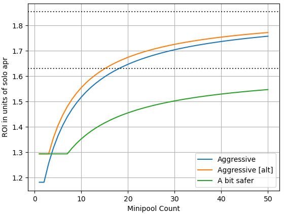
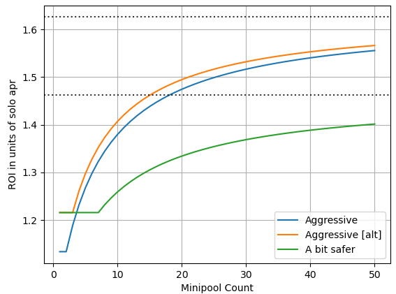

# Val's off the cuff preferences on 2024-01-09 
- The `Aggressive [alt]` curve from [bond_curve.md](bond_curves.md)
- The new RPL value capture from [direct_capture2.md](direct_capture2.md) w/35% of commission going to NOs
  - 
  - At about 5 validators (12.5 ETH bond), we match the expected Lido CSM ROI. After that, our NOs surpass it. While lower numbers are lower ROI than Lido CSM, it's a moderate tradeoff (85% as good or better), which some might opt into for ethos reasons.
  - This is the equivalent of going down from the current 10% minimum bond to a 7.6% minimum bond. I believe this is worth it in order to be competitive, even at low numbers of minipools.
- Make rETH whole in the case of outlier underperformers per ArtDemocrat's proposal with the following tweaks
  - No RPL burn
  - First take from monthly ETH (execution layer smoothie, RPL ETH commission share)
  - Next take from monthly RPL
  - Next take from RPL bond, if any
  - Next take from ETH bond -- this debt counts towards kicking validators due leakage
- Exit a validator on (leakage + debt) >1 ETH; this is about enough for 6 months covering leakage and debt to rETH at 4% apy: `32*.04*(6/12)*1.645 = 1.05 ETH`
  - Note that we'll only need to kick one of the little LEBs for this (unlike MEV theft which probably exits everything)
- Universal variable commission

As long as we're growing, I would suggest mostly using the Universal Variable commission knob for balance. This should probably eventually look like a PID controller. An initial take on it that could be driven manually: "if the deposit pool has been full for 80% of the last month, vote to increase commission 1%" and "if the deposit pool has been empty for 95% of the last month, vote to decrease commission 1%" (asymmetry on purpose as the drag of the DP is a cost). If growth slows and we're unhappy with that, we should then vote in an increase the split of commission going to NOs (vs staked RPL). If we near our self-limit, we should vote in an increase n the split of commission going to staked RPL. 

### Looking at 22% of commission to NOs
In [direct_capture2.md](direct_capture2.md), this is what we said was equivalent value capture to the current 10% of borrowed ETH minimum RPL bond. It takes 21 minipools (36.5 ETH bond) to match the proposed Lido CSM ROI, and a single minipool is about 80% as profitable as Lido CSM.

While this is mostly functional, I prefer skewing higher on the NO split and going for rapid growth. If we overachieve and get to/near our self-limit, we can always move some commission back to RPL. This split number would be one of many worthy points of discussion.

