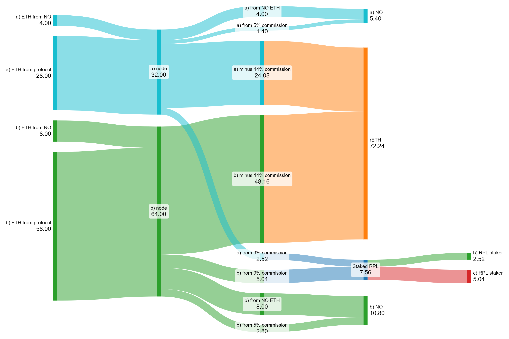

Ok. 2/16 and starting fresh.

## Motivation
Let's start with desired end state:
- Pure ETH NOs compare favorably vs competitors (eg, Lido CSM) at x bonded ETH
  - Depends on % NO commission on borrowed ETH
  - Depends on borrowed ETH per bonded ETH
- Attractive enough to rETHers to get us to y% market share
- All surplus value goes to RPL

## Core Concept
The interesting thing about the way I wrote that is that the NO portion isn't a random free knob. It's reasonably well defined. This makes it _way_ easier to trade value among parties. Essentially that one can be "fixed" and then we give more value to rETH for growth or more to RPL when growth isn't needed. We can even put a heuristic around that based on market share. Ok. Awesome. Remember for context that the proposed Lido CSM ROI is 1.5 (`solo_apy * (4*0.9+32*0.075)/4 = 1.5 * solo_apy`).

So let's start with that. We'll look at the aggressive-alt bond curve I [described](../../2023_11_rapid_research_incubator/bond_curves.md). Here it is with 5% of commission on borrowed ETH going to NOs:

Ok. This looks really good for NOs. We see that it competes favorably with Lido CSM starting at 4 minipools with a total of ~11 ETH bonded. At high bonds, we do significantly better. Very nice. Honestly, I think even 3% was functional for this setting. That said, I explicitly would like to err on the side of growth.

Given that Node operation is very competitively rewarding now, we can capture as much value as possible in RPL. The value captured by RPL is `rpl_pie_share*total_borrowed_eth_revenue`. I propose splitting this the simplest way - each period, an RPL staker's share is `eth_revenue_for_rpl*(their_rpl_stake/total_rpl_stake)` (for those of you tracking history, this means I've gone back to [direct_capture](../../2023_11_rapid_research_incubator/direct_capture.md) and have ditched [direct_capture](../../2023_11_rapid_research_incubator/direct_capture2.md)). In other words, we can keep the NO portion of the pie steady and we're simply looking for the value of `rpl_pie_share` that (a) maximizes value capture and (b) meets our [self-limiting obligations](https://rpips.rocketpool.net/RPIPs/RPIP-17). This is nice because it means that voters (NOs with staked RPL) will likely have an incentive to make rETH attractive (to increase total_borrowed_eth and thus its revenue), even if it means they take a smaller share of the pie; this is a canonical example of a positive-sum game -- RPL voters can essentially opt to have a smaller slice of a bigger pie via vote.

## Required Support
- UVC. The portion going to NOs and RPL stakers should be settable by vote. rETH's portion is simply 100% minus those two portions. This should apply across all possible minipools (noting there's some limitations around currently existing ones). I don't believe this needs to be changed often enough that we benefit significantly from automating it, at least not in the short term.
- Megapools -- gas becomes increasingly problematic as pool size decreases. This bails us out.
- Forced exits:
  - Exit a validator when an NO's `(total_leakage + debt) >0.5 ETH`; this is about enough for ~3 months covering leakage and debt to rETH at 4% apy: `32*.04*(6/12)*1.645 = .526 ETH`
    - The debt variable could be used for underperformance penalties and MEV penalties
    - Note that we can kick one minipool at a time here, which yields a ~1.5 ETH credit.

## Suggested Support
- Remove opt-in upgrades
  - They add very little security as we have withdrawals and are moving to on-chain voting for upgrades; meanwhile, they make code maintenance and testing much harder as more states are possible.
- Voting power
  -  The [pDAO charter](https://rpips.rocketpool.net/RPIPs/RPIP-23) defines the pDAO as "Node Operators, with power based on effectively staked RPL"
  - I read this plainly as requiring (a) Node Operation, (b) staked RPL, (c) a definable "effective" criteria.
  - Thus far, effective has meant "up to the value of 150% of bonded ETH"
  - I propose simply leaving that unchanged, but keeping an eye on this (eg, track voting power over time). If we see most users splitting off into ETH-only or RPL-only, power could grow concentrated here. If that happens, we might wish to change the pDAO charter (which "requires a 2/3 or greater supermajority pDAO vote"). Another option to protect governance would be to add a commission slice that is based off of "effectively staked RPL" to encourage folks to do both.
- MEV penalties
  - Allow-listed relays
  - No vanilla blocks allowed
  - oDAO-applied based on size of theft (largest bid across relays) plus a little bit (eg, 10%)
  - Some trickiness around relay API timeliness - don't expect them to be quite realtime
    - If APIs are bad, we may need to remove them from allowlist
  - Security council should be able to remove penalties -- note they can be replaced by oDAO, so this is insufficient
  - pDAO guardian must remain in place to limit total penalties
- rETH protection
  - Outlier underperformers (see ArtDemocrat's proposals) should pay restitution to rETH to meet an adequate number (eg, overall rETH performance).
  - First restitution should be funded from ETH rewards flows
    - Per reward period: EL smoothie, RPL commission share -- both of these can be taken care of when making the merkl tree, so the underperformer never gains dominion over those funds
    - At this point, record any remaining unpaid restitution as debt
    - Debt can be repaid by:
      - EL fee distributor distribution -- anyone can do this
      - CL distribution -- anyone can do this
      - CL distribution during exit -- only owner can do this without a long wait.
        - Note that this exit can be a forced exit
        - Advanced forced exits: if performing badly routinely -- kick. This is better for rETH _and_ the NO.
- Set RPL inflation to 1.5% and end RPL rewards
  - In this structure, we don't need to use RPL inflation to get more people staking RPL to meet rETH demand. Insofar as folks have unstaked, they're at least doing a service to RPL stakers by giving up their share. If they're doing something like LPing, then they're further serving RP.
  - 1.5% means the oDAO and pDAO continue to receive the same amount - this just removes the portion that went back to NOs.

## Variations to consider
- Right now I have a section of commission going to RPL stakers. This could instead go to all RPL.
  - Execution
    - Eg: ETH goes to a treasury. Every so often the treasury buys RPL with that ETH (eg via an auction)
    - Eg2: RPL can be burned against the treasury based on a fairly long TWAP (eg on uniswap pool). This would mean that if there's ever a dip, it's profitable to buy and burn RPL. Essentially, this is a market buy that happens on an ongoing basis.
  - Benefits
    - Since the capital doesn't need to be staked, that allows it to be _used_. The two main uses that come to mind are LPing and using it as collateral for a loan.
    - This may be execution-dependent, but the methods I described above accrue value to the token. In some jurisdictions this transaltes to capital gains tax instead of income tax. 
  - Negatives
    - Governance is the big one imo. We would need to redefine the pDAO (which means a 2/3 vote to change the charter). We would need to figure out voters. Right now, the "RPL-staking node operator" is a really nice overall proxy. While rETH isn't directly represented there, making rETH attractive has a direct benefit to RPL via market size.
    - Community would be the related thing. I think it would make it easier to have RPL holders/users that are less-involved with the RP community. 

## Possible pitfalls
- This looks super attractive for ETH-only NOs - what happens if we get more than rETH demand can keep up with?
  - Right now the contracts use 1 ETH to stake on-chain and pass bond-1 ETH to the deposit pool where they can efficiently get validators going. There is no way to exit the minipool queue. In this scenario, a lot of these are going to be 1.5 ETH bonds, so only 0.5 ETH will be able to hit the deposit pool
  - Suggestion: Can we track the spot in the queue without requiring the beacon contract deposit ahead of time? If so, we get three benefits: (a) more of the bond can be passed on, and (b) it becomes possible to request a minipool queue exit. For the latter, it would just reserve some ETH in the
   deposit pool for requested exits.
- It's not clear to me how migrating to megapools should work.
  - Can we have a mix of minipools in a megapool and legacy minipools? I think that should be ok from a technical standpoint...
  - Having worse capital efficiency, zero RPL rewards from inflation, and being gassier should make them pretty unattractive pretty fast imo. 
  - Maybe this is simply "don't shatter if people have both" and the rest will handle itself.
- What if we change our mind about bond curve? I think the curves can essentially be represented by three numbers: number of anchor minipools, anchor minipool size, additional minipool size. If we change our mind, I think that'd be ok. We'd essentially want a way to designate new anchor minipools, or resize the existing ones -- the credit system might make that not-too painful?

## Stepping stones
We are _currently_ struggling with NO supply. I suggest one of:
- LEB5s or LEB6s with current rules (and DAO-upgradable delegate)
  - The code makes adding these very easy if we're tweaking code; I don't know if the "DAO-upgradable delegate" portion is also similarly easy or not
  - In my [leb_safety](../../leb_safety/readme.md) work, I argue that, without forced exits, we have to defend from MEV theft _plus_ 0.64 ETH per year. Given that forced exits are likely to be possible soon, let's conservatively estimate 1 ETH of insurance here (~1.5 years). I would suggest that there be a force exit path that will be used for all remaining legacy (non-megapool) minipools 2 years after the launch of megapools. I think if we're comfortable with LEB4s and forced exits, we should thus also be comfortable with LEB5s with "coming soon forced exits".
- RPL loans
  - Fund a multisig with ~10k RPL for the first iteration of this program, which is enough for around ~500 LEB8s
  - Take collateral in the form of rETH/ETH BPTs (balancer liquidity tokens)
  - 2.5 ETH worth of RPL for 1 year; 80% LTV; up-front fee of 10% which is refundable if used to launch a minipool
  - This means a user would:
    - post 3.26 ETH worth of rETH/ETH BPT using their node or withdrawal address
      - 3.01 are locked as collateral 
      - 0.25 are given to the multisig
    - After a year, if the node in question (a) staked the RPL within a week of the loan, (b) started a minipool within two weaks of the loan, and (c) didn't exit any minipools: then the 0.25 ETH fee is sent back to them

## Flow example w/"Solo rewards that correspond to x ETH"
What does this look like in practice? Let's have a look at a small example.

Let's walk through this.

There are 3 users:
- User (a) stakes 4 ETH and 0 RPL
- User (b) stakes 8 ETH and 100 RPL
- User (c) stakes 0 ETH and 200 RPL

Now let's follow the flows:
- The best units to think about here is "Solo rewards that correspond to x ETH"
- Stage 1: we see that the NO and protocol ETH rewards are contributed
- Stage 2: the nodes have 3 validators worth of solo rewards
- Stage 3/4: rewards from the validators get split up
  - The NO claims the full solo rewards from the ETH they contributed
  - The NO gets 5% commission of the rewards from the protocol ETH
  - 9% commission of the rewards from the protocol ETH goes to _all_ Staked RPL
  - 86% of the rewards from the protocol ETH go to rETH
- Stage 5: Staked RPL rewards are split up by RPL stake

In the end:
- User (a) earns the equivalent of 5.4 ETH of solo stake (note that `5.4/4=1.35*solo`, which matches the starting point of the first plot)
- User (b) earns the equivalent of 13.32 ETH of solo stake. Here the APY vs solo stake is not as obvious -- it depends on the RPL ratio.
  - Eg, if the exchange rate is 0.02, then this user would have 10 ETH of value invested earning the equivalent of 13.32 ETH of solo stake. That would mean an ROI of `13.32/(8+.02*100) = 1.332*solo`.
  - Now consider it again with an exchange rate of 0.015. That would mean an ROI of `13.32/(8+.015*100) = 1.402*solo`.
- User (c) earns the equivalent of 5.04 ETH of solo stake. Again, RPL ratio matters.
  - With a ratio of 0.02: `5.04/(.02*200) = 1.26*solo`
  - With a ratio of 0.015: `5.04/(.015*200) = 1.68*solo`