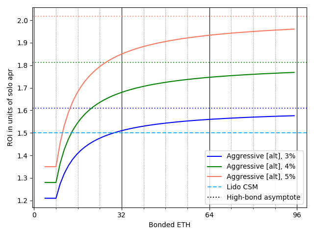
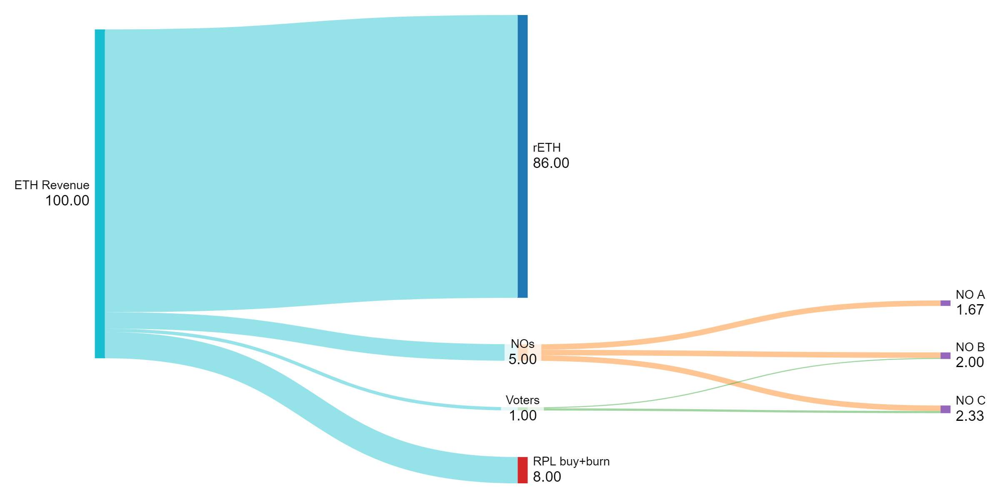
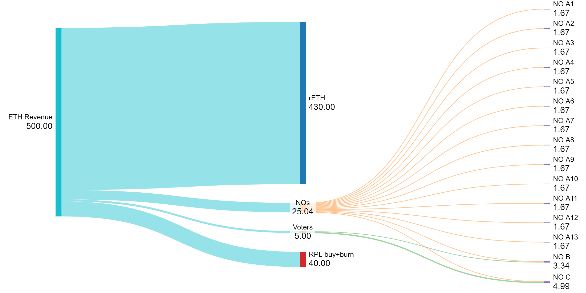

## Table of Contents
1. [Motivation](#motivation)
2. [Core concept](#core-concept)
   1. [Smaller bonds for capital efficiency](#smaller-bonds-for-capital-efficiency)
   2. [RPL revenue for value capture](#rpl-revenue-for-value-capture)
      1. [Flow diagram examples](#flow-diagram-examples)
3. [Required support](#required-support)
4. [Choose your depth](#choose-your-depth)

## Motivation
Let's start with desired end state:
- We're trying to make pure ETH NOs compare favorably vs competitors (eg, Lido CSM) starting at some minimum level of bonded ETH
  - This depends on NO commission % on borrowed ETH
  - This depends on borrowed ETH per bonded ETH
- We're trying to attract enough rETHers to get us to desired market share
- We're trying to capture all surplus value in RPL

## Core concept

### Smaller bonds for capital efficiency
We'll start by determining a good NO commission % using the aggressive-alt bond curve I [described](../2023_11_rapid_research_incubator/bond_curves.md). The summary of that idea is that we can allow smaller ETH bonds safely by enabling MEV theft penalties across a whole node (multiple minipools); smaller ETH bonds make us dramatically more capital efficient.

Remember for context that the proposed Lido CSM ROI is 1.5 (`solo_apy * (4*0.9+32*0.075)/4 = 1.5 * solo_apy`). Here is RP capital efficiency with 3%/4%/5% of commission on borrowed ETH going to NOs:

We see that 5% commission competes favorably with Lido CSM starting at ~11 ETH bonded (2 4-ETH minipools and 2 1.5-ETH minipools). At high bonds, we do significantly better. Even 3% was able to beat out Lido CSM (starting at 30.5 ETH, aka 2 4-ETH minipools and 15 1.5 ETH minipools). That said, I explicitly would like to err on the side of growth, so I propose using 5%.

### RPL revenue for value capture
Since total rETH commission is much higher (per bonded ETH) with these lower bonds, Node Operation can be more than competitive as shown above -- and surplus revenue can be directed to RPL (pro rata based on RPL stake). The value captured by RPL is `rpl_pie_share*total_borrowed_eth_revenue`. In other words, self-interested holders are looking for the value of `rpl_pie_share` that (a) maximizes value capture and (b) meets our [self-limiting obligations](https://rpips.rocketpool.net/RPIPs/RPIP-17). This is nice because it means that voters (NOs with staked RPL) will likely have an incentive to make rETH attractive (to increase total_borrowed_eth and thus its revenue), even if it means they take a smaller share of the pie; this is a canonical example of a positive-sum game -- RPL voters can essentially opt to have a smaller slice of a bigger pie via vote.

#### Flow diagram examples

This view goes 1 step past the pie chart to show what individual users receive.

Let's walk through this. There are 3 users:
- User (a) stakes 4 ETH and 0 RPL
- User (b) stakes 4 ETH and 100 RPL
- User (c) stakes 0 ETH and 100 RPL

Now let's follow the flows:
- Stage 1: We have 100% of the ETH staking revenue from rETH's ETH
- Stage 2: We split that up per the pie chart
- Stage 3:
  - Ethereum-bonded Node Operators get commission on the borrowed ETH they support on the validators they run
  - RPL stakers get commission on all borrowed ETH in the protocol, based on the amount of RPL they stake
  - Note that since User B staked the same as User A for ETH and the same as User C for RPL, their rewards are simply the sum of Users A and C -- it's immaterial that the stakes happen "together" or not

Now let's illustrate one more thing. Here we've grown our revenue 10x by onboarding a bunch of ETH-only stakers.
There are 21 users:
- 19x [User (a) stakes 4 ETH and 0 RPL]
- User (b) stakes 4 ETH and 100 RPL
- User (c) stakes 0 ETH and 100 RPL

Again, let's follow the flows:
- Stage 1: We're showing revenue as 1000% (to keep the relative revenue unit the same in both flow diagrams)
- Stage 2: We split that up per the pie chart
- Stage 3:
  - Ethereum-bonded Node Operators get commission on the borrowed ETH they support on the validators they run
  - RPL stakers get commission on all borrowed ETH in the protocol, based on the amount of RPL they stake

The key takeaways here are that the Ethereum portion stays equally attractive -- you get the same ROI as above. The RPL portion, however, gets 10x as attractive. RPL's success is very directly tied into the success of the protocol and the TVL that it's able to attract to rETH. 

For simplicity, I've made all ETH users have a single 4-ETH pool. Note that it really doesn't matter for this view: even if they have a mix of 4-ETH and lower bond pools, the _share_ of the revenue based on borrowed ETH will get split the same way. The users will, ofc, get better ROI as they're bonded ETH per borrowed ETH ratio decreases.

## Required support
- Universal Variable Commision
  - The portion going to NOs and RPL stakers should be settable by vote. rETH's portion is simply 100% minus those two portions 
  - This should apply across all possible minipools (noting there's some limitations around currently existing ones)
  - I don't believe these need to be changed often enough that we benefit significantly from automating it, at least not in the short term
- Megapools -- gas becomes increasingly problematic as pool size decreases. This bails us out.
- Forced exits
  - Critical to protect against loss scenarios associated with MEV theft and abandonment
  - Exit a validator when an NO's `(total_leakage + debt) >0.5 ETH`; this is about enough for ~3 months covering leakage and debt to rETH at 4% apy: `32*.04*(6/12)*1.645 = .526 ETH`
    - The debt variable could be used for underperformance penalties and MEV penalties
    - Note that we can kick one minipool at a time here, which yields a ~1.5 ETH credit.

## Choose your depth
This document is the top tier of importance.

I don't recommend moving on until you feel comfortable with the concepts in this document.

- [Top tier](./readme.md)
- [Tier 2](./readme_tier2.md)
- [Tier 3](./readme_tier3.md)
