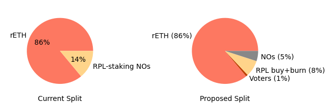

## Motivation
Let's start with desired end state:
- Pure ETH NOs compare favorably vs competitors (eg, Lido CSM) at x bonded ETH
  - Depends on NO commission % on borrowed ETH
  - Depends on borrowed ETH per bonded ETH
- Attractive enough to rETHers to get us to y% market share
- All surplus value goes to RPL

## Core Concept
We'll start by determining a good NO commission % using the aggressive-alt bond curve I [described](../2023_11_rapid_research_incubator/bond_curves.md). The summary of that idea is that we can allow smaller ETH bonds safely by enabling MEV theft penalties across a whole node (multiple minipools); smaller ETH bonds make us dramatically more capital efficient.

Remember for context that the proposed Lido CSM ROI is 1.5 (`solo_apy * (4*0.9+32*0.075)/4 = 1.5 * solo_apy`). Here is RP capital efficiency with 3%/4%/5% of commission on borrowed ETH going to NOs:

We see that 5% commission competes favorably with Lido CSM starting at ~11 ETH bonded (2 4-ETH minipools and 2 1.5-ETH minipools). At high bonds, we do significantly better. Even 3% was able to beat out Lido CSM (starting at 30.5 ETH, aka 2 4-ETH minipools and 15 1.5 ETH minipools). That said, I explicitly would like to err on the side of growth, so I propose using 5%.

Given that Node Operation is more than competitive with the above, we can capture as much value as possible in RPL. The value captured by RPL is `rpl_pie_share*total_borrowed_eth_revenue`. I propose splitting this the simplest way - each period, an RPL staker's share is `eth_revenue_for_rpl*(their_rpl_stake/total_rpl_stake)`. In other words, we're looking for the value of `rpl_pie_share` that (a) maximizes value capture and (b) meets our [self-limiting obligations](https://rpips.rocketpool.net/RPIPs/RPIP-17). This is nice because it means that voters (NOs with staked RPL) will likely have an incentive to make rETH attractive (to increase total_borrowed_eth and thus its revenue), even if it means they take a smaller share of the pie; this is a canonical example of a positive-sum game -- RPL voters can essentially opt to have a smaller slice of a bigger pie via vote.

### Flow diagram example
What does this look like in practice? Let's have a look at a small example.

Let's walk through this.

There are 3 users:
- User (a) stakes 4 ETH and 0 RPL
- User (b) stakes 8 ETH and 100 RPL
- User (c) stakes 0 ETH and 200 RPL

Now let's follow the flows:
- The best units to think about here is "Solo rewards that correspond to x ETH"
- Stage 1: we see that the NO and protocol ETH rewards are contributed
- Stage 2: the nodes have 3 validators worth of solo rewards
- Stage 3/4: rewards from the validators get split up
  - The NO claims the full solo rewards from the ETH they contributed
  - The NO gets 5% commission of the rewards from the protocol ETH
  - 9% commission of the rewards from the protocol ETH goes to _all_ Staked RPL
  - 86% of the rewards from the protocol ETH go to rETH
- Stage 5: Staked RPL rewards are split up by RPL stake

In the end:
- User (a) earns the equivalent of 5.4 ETH of solo stake (note that `5.4/4=1.35*solo`, which matches the starting point of the first plot)
- User (b) earns the equivalent of 13.32 ETH of solo stake. Here the APY vs solo stake is not as obvious -- it depends on the RPL ratio.
  - Eg, if the exchange rate is 0.02, then this user would have 10 ETH of value invested earning the equivalent of 13.32 ETH of solo stake. That would mean an ROI of `13.32/(8+.02*100) = 1.332*solo`.
  - Now consider it again with an exchange rate of 0.015. That would mean an ROI of `13.32/(8+.015*100) = 1.402*solo`.
- User (c) earns the equivalent of 5.04 ETH of solo stake. Again, RPL ratio matters.
  - With a ratio of 0.02: `5.04/(.02*200) = 1.26*solo`
  - With a ratio of 0.015: `5.04/(.015*200) = 1.68*solo`

## Required Support
TODO - fill in

## The important stuff is above this section
🛑🛑 Please stop for a moment 🛑🛑

If you feel comfortable with everything above this section, by all means feel free to continue. But if you don't, please focus on the part above and ask questions. The portion above is dramatically more important than the sections below.

TODO - finish