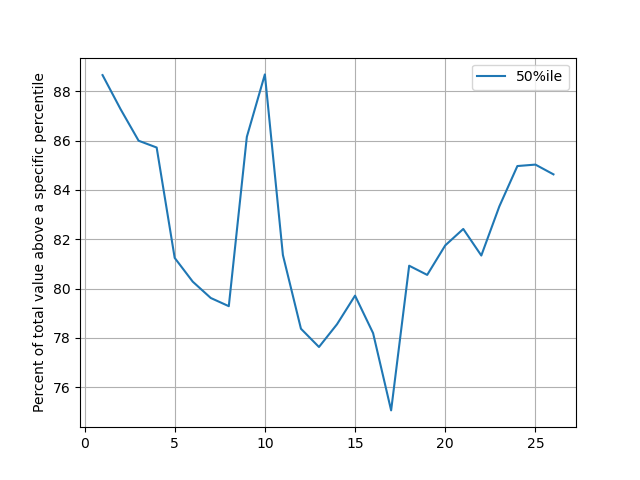
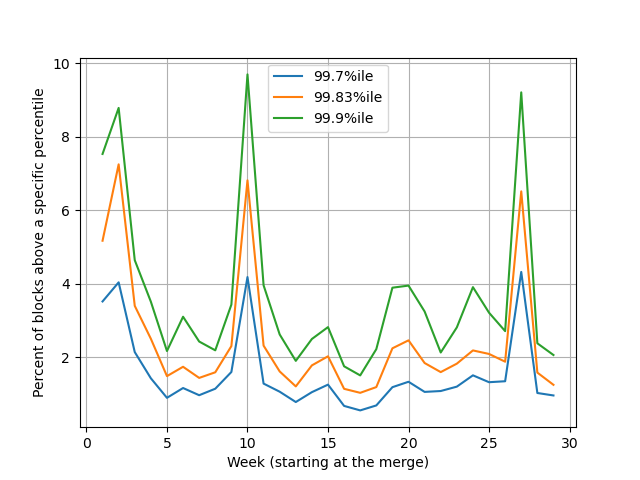
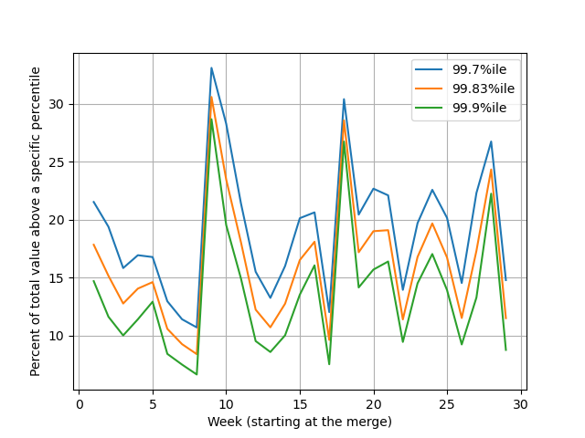
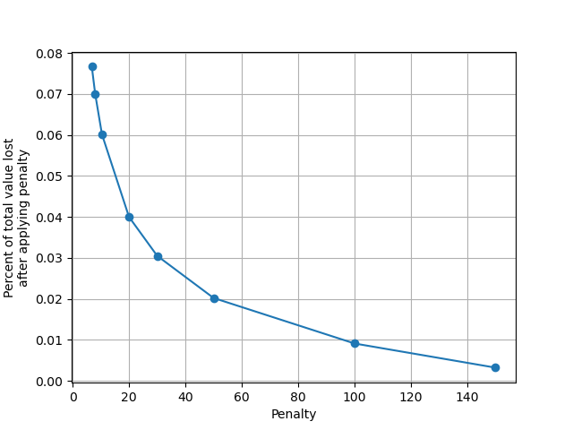

# Risk analyis for LEBs
March 2023

## Abstract
Previous work has looked into the amount of bond that's necessary for safety assuming various
malicious behaviors and assuming various available mitigations. See for example,
[Ken Smith's work](https://github.com/htimsk/LEBminipools) and 
[Stader's ETHx Litepaper](https://www.staderlabs.com/docs/eth/Stader%20ETH%20Litepaper.pdf).

Both of these analyses dramatically underestimate the potential for loss because they assume that
the market they've been able to sample is truly representative of the future market. I will show
that we already have strong evidence that the EL reward market varies significantly over time. I
will use that understanding to estimate some "clearly" unsafe bond levels.

In the end, I conclude that it's possible to enable LEB4s (or in theory smaller) using either a
trust-based penalty system with node-level collateral OR a system relying on negative commission OR
a hybrid system to try to gain benefits of both options.

## A brief aside about penalties
Right now penalties allow 2 strikes and thereafter are 10% of the NO deposit amount (ie, 1.6 ETH per
penalty for a 16 ETH minipool and 0.8 ETH per penalty for an LEB8). This doesn't make sense. EL
reward theft doesn't scale with NO deposit size, and there is no reason to allow for strikes for EL
reward theft.

I believe penalties _must_ be reworked to cover the amount stolen and have no strikes allowed. In
the immediate term, it's possible to calculate that desired value and apply enough penalties to get
a similar effect, but let's not get into the details of that since that's not the main subject.

For the purposes of this analysis, I'll assume penalties can be sized to cover the damage.

## Types of losses
- Correlated slashing
- Slashing and leakage
- Execution layer reward theft - continuous
- Execution layer reward theft - large block

## Analyzing each type of loss

### Correlated slashing
We can ignore this term. No RP user should be able to cause this themselves, and if they can there's
no reason to believe they could do so at all profitably.

### Slashing and leakage
From a game theory standpoint, an adversary "should" slash themselves if they have no remaining
stake. They would then allow leakage on their way out. This increases the cost to the protocol of
kicking them without incurring any cost on their end. We will ignore this term as any situation
that's considered "safe" relies on the NO having _some_ stake left.

### Execution layer reward theft - continuous
As of when I'm writing, EL rewards make for very roughly 2% APR. We see from the data that about 18%
of EL reward value is below the median, so we can use that as a reasonable estimate of what we can
expect from continuous theft for one validator. Something like 0.0036%, or 0.115 ETH/year.



However, if an adversary has a large number of validators stealing continuously, it becomes more
appropriate to use the average APR of 2% instead of the median. In that case, we are losing ~0.64ETH
per validator per year.

This variable must be considered if we're not able to execute on forced exits. Essentially, if we
want a 5-year buffer and don't have forced exits, we'd want to buffer by .64*5 = 3.2 ETH _beyond_
the ETH directly used to counteract a large block theft.

### Exeution layer reward theft - large block
This plot shows the percent of blocks above a specific percentile. The key takeaway is that the
market is not (at all) the same every week. There is no particular reason to expect we've seen
anything remotely like the bounds of what the EL rewards market can look like. One could
speculatively argue that EL rewards will be much higher during a bull market or once
incredibly-valuable layer2 commit transactions are commonplace. There are arguments for a reducing
impact of EL rewards as well, but we must plan for the worst case.

We have had 3 "high-execution-reward" weeks so far, out of 29. Over 10% is quite common. For the
following analysis, I'll assume we need to defend against an EL reward market that looks like that
all the time. I consider this a bad case, but not at all pushing the amounts we could speculate the
market reaches.



**LEB8s without forced exits:** During such a period, the 99.9th percentile block is ~9 ETH.
Combined with the current ~77 days per proposal, this would mean one out of 11k minipools would
profit from stealing each week at that level (ignoring the RPL bond). If the market acts like this
for a year, roughly 1 in 200 minipools would profit from stealing. While the 2.4 ETH minimum RPL
bond gets us back to a "safe" level, it only does so by 1.4 ETH, which is 2 years of continous
theft.

**LEB4s without forced exits:** During such as period, the 99.7th percentile block is just over 4
ETH. This would mean roughly one out of 3700 minipools would profit from stealing each week. If the
market acts like this for a year, roughly 1 in 70 minipools would profit from stealing. A 2.8 ETH
bond would get us to a safe level for ~4 years.

**LEB4s with forced exits:** During such a period, the 99.83rd percentile block is just over 6.8
ETH. This would mean roughly one out of 6500 minipools would profit from stealing each week. If the
market acts like this for a year, roughly 1 in 120 minipools would profit from stealing.

## Conclusions
### Minipool loss
So - what would the damage be? After a year with the market looking like that, assuming everyone is
purely maximizing profit and sybil attacking to the max (implies minimum RPL bond too), we'd see
~.5% of LEB8s without forced exits steal, ~1.4% of LEB4s without forced exits steal, and ~.8% of
LEB4s with forced exits steal. These minipools become a drain to RP. If forced exits exist, they are
exited; if not, they stick around stealing EL rewards.

### Value loss
Here we see a chart showing the value above a specific percentile.



Since we don't much correlation between large lotto block weeks and the plot above, we'll consider
value above a threshold across the entire time-frame, instead of on a per-week basis.

The chart below shows value loss if we assume theft whenever that's greater the penalizable amount.
The loss is the size of the block minus the penalty. This assumes we can force exit the minipool, if
we cannot, we may have to keep a small reserve unpenalized to "bribe" the user into exiting.



The general trend is clear, with increasing penalizable collateral allowing for much lower loss.
While there was no obvious pattern, there was a lot of volatility, with 3 clearly "higher" weeks.
I'd suggest padding 2-3x on this value loss chart to account for a potential bad market in terms; in
this case bad means that value is concentrated in further outliers, as outliers are most difficult
to defend against with penalties. I'll pad 3x for the rest of the analysis; since EL rewards are
around 1/3 of total rewards, that lets us read directly off the chart as if it weren't just percent
of total EL value, but net value.

From the chart we see a loss of 7.7%/7%/6% for 6.8/8/10.4 ETH of penalty. This is quite significant.
Eg, compare with our 15% commission or the deposit pool, which we try to keep to a max of 5% drag.

We are able to further decrease losses to 4%/3.1%/2% at 20/30/50 ETH of penalty respectively.
Finally, we see quite low losses around 0.9%/0.3% at 100/150 ETH of penalty.

If we have no forced exits, we would also suffer the loss of execution rewards going forward, but
it's a smaller effect than the large block theft damage. We'd see .005/3 = .17% for LEB8s, or
.008/3 = .27% for LEB4s. Unlike the large block theft term, it should be noted that if the market
continues this way for many years, it would continue accruing - eg, after 2 years we'd be at
.34%/.54% respectively for LEB8s/LEB4s.

### It could be worse
Remember, I'm using something like the worst 10% we've seen as a model for lotto block frequency and
something like 3x worse than the average for value in extrem outliers. It's _entirely possible_ that
the market leaves these ranges entirely.

I'll also note that I'm looking at just one relay here. Looking at more will certainly show more
chances for lottery blocks, though I can't quantify by how much.

(It's also worth noting it could be better; not everyone is trying to steal maximally, EL rewards
may not grow, and outlier EL rewards may carry less of the total EL value. Maybe.)

## Mitigation

### Node level penalties
Large block theft relies on abusing events that are rare per validator and random. This means that a
strong defense would be to penalize at the node level. For example, if you have 5 LEB4s with 2.8 ETH
worth of RPL, the total bond is actually 34 ETH if we're able to penalize at the node level. This
would require somewhat more complex code to determine safe cutoffs, but it would mitigate the attack
an arbitrary amount. Here we'd be literally trading off the ability for more folks to reach a
particular level against the worst-case potential loss to the protocol.

### Negative Commission (aka, assign Execution Layer Rewards to NOs)
This variant avoids the theft concept entirely by assigning EL rewards to NOs. The NOs would take on
a negative commission for the CL rewards to prevent rETH from losing out.

A rough implementation outline:
- Use smoothing pool or other large sample to calculate average EL rewards for reward period X
- This value is used to calculate a commission correction that would have resulted in the expected
  split of rewards.
  - Desired: `NO_apr = (NO_deposit*EL_apr + NO_deposit*CL_apr + commission*(32-NO_deposit)*EL_apr + commission*(32-NO_deposit)*CL_apr))/NO_deposit`
  - Assigning EL rewards to NO with correction factor:
    `NO_apr = (NO_deposit*EL_apr + NO_deposit*CL_apr + (32-NO_deposit)*EL_apr + corrected_commission*(32-NO_deposit)*CL_apr))/NO_deposit`
  - And now we can solve for `corrected_commission = commission - (EL_apr/CL_apr)(1-commission)`
    <details> <summary> The math </summary>
  
    ```
    - (NO_deposit*EL_apr + NO_deposit*CL_apr + commission*(32-NO_deposit)*EL_apr + commission*(32-NO_deposit)*CL_apr))/NO_deposit = (NO_deposit*EL_apr + NO_deposit*CL_apr + (32-NO_deposit)*EL_apr + corrected_commission*(32-NO_deposit)*CL_apr))/NO_deposit
    - commission*(32-NO_deposit)*EL_apr + commission*(32-NO_deposit)*CL_apr = (32-NO_deposit)*EL_apr + corrected_commission*(32-NO_deposit)*CL_apr
    - commission*EL_apr + commission*CL_apr = EL_apr + corrected_commission*CL_apr
    - corrected_commission = (commission*EL_apr + commission*CL_apr - EL_apr)/CL_apr
    - corrected_commission = commission*(EL_apr/CL_apr) + commission - (EL_apr/CL_apr)
    - corrected_commission = (EL_apr/CL_apr)(commission-1) + commission
    - corrected_commission = commission - (EL_apr/CL_apr)(1-commission)
    - Note that corrected_commission is likely negative. Eg, for 14% commision with EL being 1/3
      of rewards: corrected_commission = .14 - ((rewards/3)/(2*rewards/3)*(1-.14)) = -0.29
    ```
    
    </details>
- The pDAO votes in a corrected commission to account for EL rewards; quarterly is likely good
  enough
- When claiming rewards the corrected commission is used

Because execution layer rewards are volatile, it's possible that the amount owed to rETH holders is
larger than the total amount of rewards. This has implications for the protocol and the users.

For the protocol, this is ok - we can keep track of an amount owed that will be paid back from the
principal on exit, or by the NO before that. A suggested implementation would include this amount
owed when determining if RPL rewards should be given - ie, the total value of (staked RPL and ETH
minus amount owed) would need to be greater than (10% of protocol ETH + starting user deposit
amount). We would also have a lower threshold to take action for protocol security; since this no
longer has to protect from EL reward theft, it can be much lower, such as 1.5 ETH per minipool (it
should be in ETH to avoid volatility risk to the protocol, and it needs to at least cover
self-slashing to grief). If the total value of (staked ETH minus amount owed) drops below the
threshold, RPL should be auctioned to bring them back above that threshold. If there is no longer
any RPL to auction, a minipool should be force exited.

For the user, the prospect of rewards being negative if they are unlucky might not be pleasant. One
option to avoid this is to use the smoothing pool. Smoothing pool users remove the luck component
and more or less guarantee positive results (insofar as this current time period is like the one
used to set corrected_commission anyhow). The only issue is that the smoothing pool opens up the
potential for EL reward theft again, which means it needs penalties. This is still possible by using
the Node Level Collateral previously mentioned, but it would not be possible for small stakers.

It's important to point out that this solution doesn't depend on the oDAO at all! There is no need
for penalizing, tracking EL rewards, or manual force exiting (this could be done with a smart
contract and a keeper bot that anyone can run).

### Hybrid approach
Users can choose to either:
- Accept the negative commission
  - Smoothing pool not available
  - No per-node minimum collateral
- Node level penalties
  - Accept a decision-making body that assigns penalties
  - Requires a specified amount of total collateral on the node (start at 30?)
  - Smoothing pool available
    - Accept that very large blocks may be (rarely) stolen when they exceed the penalty possible 

There should be a large time lock in swapping to prevent any gaming. I'd suggest that after a
request to swap category there would need to be two updates for the negative commission. That would
ensure that the NO had no relevant predictive information to game the system.

An important consideration here is whether we'd be willing to _raise_ the required total collateral
on the penalty option. If not (my assumption thus far), then we need to heavily defend against a
worst case scenario including increased EL rewards, increased proprotion of value in outlier EL
rewards, and everyone attempting to steal

If, on the other hand, we are willing to raise this level in response to changes in context (with
appropriate notice, etc), then we can have _dramatically_ looser requirements. If we monitor for
theft and see that it begins to happen, we can simply increase the required collateral to prevent
further losses.

## Conclusion
My suggestion would be for a hybrid approach:
- Trustless negative commission available with no minimum collateral 
- Penalty-based smoothing pool avaialable, with ~10 ETH of minimum collateral
  - The minimum collateral is subject to change by vote with 2 months' notice before taking effect

This enables the following options:

| NO size | Option               | Trustless? | Predictable Rewards  |
|---------|----------------------|------------|----------------------|
| Small   | Negative Commission  | Yes        | No                   |
| Medium  | Node level penalties | No         | Very                 |
| Medium  | Negative Commission  | Yes        | Somewhat             |
| Large   | Node level penalties | No         | Very                 |
| Large   | Negative Commission  | Yes        | Yes                  |

## Acknowledgements
Thanks to knoshua for early draft review and discussion.
