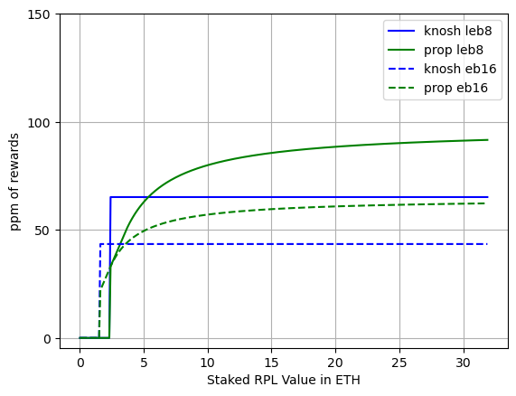
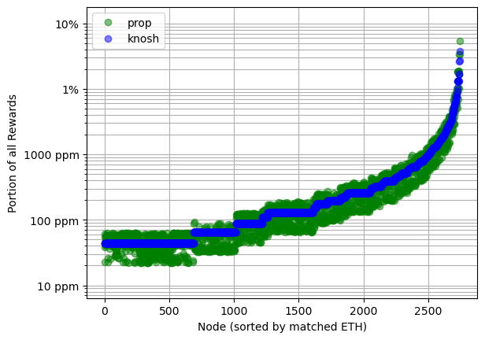
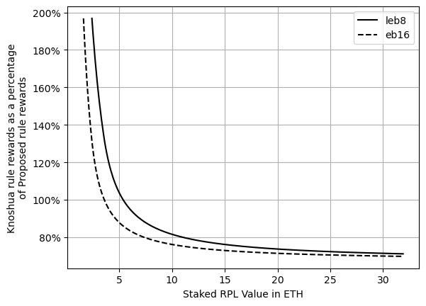
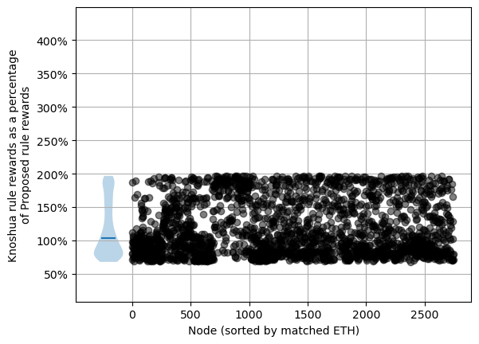

# [DRAFT] RPL Staking Analysis and Initial Suggestion
July 2023

## High level RPL-staking options

### [DRAFT] Visualized rule sets

### [DRAFT] Current rules

- "Minimum" RPL stake is 10% of borrowed ETH (aka protocol ETH, pETH, matched ETH)
  - You must be over this threshold _including_ a new minipool to launch a new minipool
  - You must be over this threshold at rewards snapshot time to be eligible for RPL rewards
- Maximum effective RPL stake is 150% of bonded ETH (aka NO ETH, nETH, provided ETH)
  - Up to this much RPL at rewards snapshot time can be eligible for RPL rewards
- The NO share of inflation gets split up per-effective-RPL

### [DRAFT] "Knoshua" rules
- "Minimum" RPL stake is 10% of borrowed ETH (aka protocol ETH, pETH, matched ETH)
  - You must be over this threshold _including_ a new minipool to launch a new minipool
  - You must be over this threshold at rewards snapshot time to be eligible for RPL rewards
- Only the minimum is "effective".
- If you're below 10% of borrowed ETH, you get no rewards
- The NO share of inflation gets split up per-effective-RPL

### [DRAFT] Proposed rules
- "Minimum" RPL stake is 10% of borrowed ETH (aka protocol ETH, pETH, matched ETH)
  - You must be over this threshold _including_ a new minipool to launch a new minipool
  - You must be over this threshold at rewards snapshot time to be eligible for RPL rewards
- Rewards are based on weight
  - If you're below 10% borrowed ETH, weight is 0
  - From 10%-15% borrowed ETH, weight is linear with the amount of borrowed ETH
  - Above 15%, weight follows a logarithmic curve, rising forever, but ever-more-slowly
- The NO share of inflation gets split up per-vote-weight

## The proposed plan
- Take up the "Proposed rules" above in order to:
  - Reward primarily based on borrowed ETH, as this is what allows RP to meet rETH demand
  - Discourage large-scale speculation while getting RPL yield from the protocol
    - Encourages speculative holdings either exposed to inflation, or active in defi
  - Avoid making RPL-staking high-touch. Importantly, there should be essentially no downside to
    being slightly above the minimum
- Move the minimum to withdraw to 15% borrowed ETH (the end of the linear region)
  - This minimizes how "locked" users are, while also acknowledging that RPL is highly volatile; we
    don't want to encourage users to end up below the "minimum" used to start a minipool
- Keep some kind of time lock around staking to avoid gaming reward snapshot times
  - There has been talk about tracking stake at all times instead of just at the snapshot time; I
    believe this would be extremely challenging in a post-oDAO world, and we should be designing
    with that in mind
  - The current lock (can't unstake for 28 days after staking) is functional, which is a fairly
    strong argument for keeping it as is
    - One fairly modest suggestion that's been floated is to make an exception for claimAndStake.
      The premise here is that there is little room for gaming with these amounts, and many folks
      might inadvertently lock their stake by doing this.

## A more detailed comparisons between rule sets

### [DRAFT] Current vs Knoshua
|      |      |
|:------------------------------:|:-----------------------------------:|
|  |  |

- When providing the same amount of rETH supply (aka, at one point on the x axis), the current rules
  have a massive variation in RPL rewards of up to 15x based on the amount of RPL staked. Knoshua's
  rules have zero variation.
- Knoshua's plan _strongly_ favors people that are RPL-hesitant and want to join with low exposure.
  For folks at the minimum, they'd see their rewards ~4.3x
  - This also makes it easier to attract new NOs since the higher rewards can defray the up-front
    RPL price risk
- Knoshua's plan would see the median current NO get ~2x the rewards of the current plan
  - A fair number of NOs end up lower than current rewards.
- Knoshua's plan strongly favors LEB8s. This aligns RPL rewards to what helps the protocol (the
  ability to meet rETH demand).

### [TODO] Current vs Proposed
|      |      |
|:------------------------------:|:-----------------------------------:|
|  |  |

- When providing the same amount of rETH supply (aka, at one point on the x axis), the current rules
  have a massive variation in RPL rewards of up to 15x based on the amount of RPL staked. For the
  proposed rules, that variation is down to ~3x (technically, the log gains continue indefinitely
  but with aggressively lowering marginal benefit; here I used 12 ETH worth of RPL staked on an LEB8
  as a realistic "limit")
- The proposed plan's plan _strongly_ favors people that are RPL-hesitant and want to join with low
  exposure. For folks at the minimum, they'd see their rewards ~2.44x
  - This also makes it easier to attract new NOs since the higher rewards can defray the up-front
    RPL price risk
- The proposed plan would see the median current NO get over 2x the rewards of the current plan
  - Very few NOs would see a decrease in their rewards (only 16-ETH minipool holders with more than
    8.1 ETH of RPL staked per 16-ETH minipool)
- The proposed plan strongly favors LEB8s. This aligns RPL rewards to what helps the protocol (the
  ability to meet rETH demand).

### [TODO] Proposed vs Knoshua
|      |      |
|:------------------------------:|:-----------------------------------:|
|  |  |

This is not the main comparison point, tbh, so I'll be quick:
- The biggest gains are smaller with the proposed plan
- The biggest losses are smaller with the proposed plan
- There are more "winners" with the proposed plan and current allocations

## Brass Tacks

### RPL Value
Some people have mentioned fears along the lines of "reducing the rewards for high-RPL-allocation
NOs will cause them to sell and RPL value to plummet".\
I don't see this at all. 

Let's work out an extreme example with the current and proposed rulesets. We'll assume the worst
case: an NO with 1 16-ETH minipool and the max yielding 24 ETH worth of RPL staked. For this first
cut, we'll assume an unchanging RPL/ETH ratio. 

Right now this NO is getting:
- 5.62% ETH APR (courtesy of Rocket Watch)
- 8.08% RPL APR (ditto)
- For a total blended APR of 7.10% (`(24*.0808 + 16*.0562)/40`)

With the proposed plan, they'd get:
- 5.62% ETH APR
- 3.08% RPL APR
- For a total blended APR of 4.10%

Fair enough, that's a hefty drop... But! Let's think about why our NO is choosing this massive
amount of RPL exposure far above the minimum (15x!). There's really only one reason, which is that
they hope that the RPL value will go up. I doubt we'll find many bulls who are expecting less than
a 2x ratio improvement in two years (we'll pretend it's smoothly linear and call that 1.41x per
year). Let's use that and redo the example. 

Right now this NO is getting:
- 5.62% ETH APR
- 8.08% RPL APR
- For a total blended APR of 33.68% (`(24*.0808*1.41 + 24*0.41 + 16*.0562)/40`)

With the proposed plan, they'd get:
- 5.62% ETH APR (courtesy of Rocket Watch)
- 3.08% RPL APR (ditto)
- For a total blended APR of 29.45% (`(24*.0308*1.41 + 24*0.41 + 16*.0562)/40`)

There _is_ a difference there, but it's _not_ dramatic, because the main factor is ratio growth.

So what do I expect if not a large-scale sell-off from these folks?
One of:
- Hold it anyhow - they're here for the ratio gains
- Put it to use in defi - an RPL loan might pay close to RPL yield at the minimum, for example,
  which would be over 15%
- If, and ONLY if, the NOs were already uncertain about their RPL exposure, this might push them to
  sell some amount. That could go into LEB8s, in order to get much higher RPL rewards (alongside the
  ETH rewards), or it might leave the RP system.

Finally, I'll note that this proposal helps us attract NOs better. That lets us meet demand better.
That may come back as improved fundamental value for RPL. In our example, it would only take going
from an expectation of 2x to an expectation of 2.19x to _prefer_ the proposed plan -- despite being
at literally the worst case allocation for this rewards change.

### [DRAFT] Why change? People entered with this ruleset.

I believe consistency is important. We shouldn't change things just because we can. That said, I
also don't believe we should totally shackle ourselves forever based on past decisions.

Let's start with another question -- where does the current ruleset come from?
- The minimum
  - Initial design by fireeyes -- no insight into reasoning
  - Often used in RPL price models to set the fundamental floor value of RPL 
  - When we added LEB8s, we wanted to keep the fundamental floor value in those models unchanged,
    which is why we went with keeping it constant as a percent of borrowed ETH
- The maximum
  - Initial design by fireeyes -- no insight into reasoning [?? IS THIS RIGHT?]
  - There was a rather stressful vote when adding LEB8s about whether the maximum should be 150% of
    borrowed ETH, 150% of bonded ETH, or flat per minipool
  - During that vote, there were attempts to justify the original 150% number for 16-ETH (so that 
    we could better understand what it meant to minimize change). The best reason I saw was that it
    served as "protected speculation" for heavily RPL-aligned individuals.
  - There was an interaction with the minimum threshold to withdraw until Redstone. It was possible
    to instantly stake RPL and have that affect rewards, so if people could withdraw at will, they
    could get all the benefits of max stake while only having the RPL staked for a moment. [?? IS 
    THIS RIGHT? DID WE HAVE THE TIMELOCK BEFORE REDSTONE?]
- Keeping the rules the same
  - All else being equal, stability is good
  - Right now we're rewarding speculating with in the protocol, rather than creating rETH supply
    - This is _not_ aligned with the protocol's needs, which is a suitably important reason to make
      changes.
  - Now that we're post-Shapella, people can exit if the rules truly don't suit them. This makes it
    less critical to keep things exactly the same