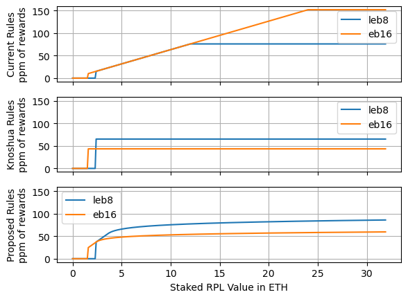
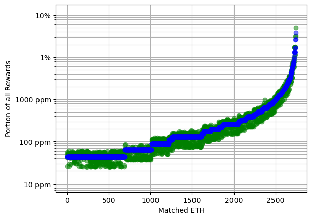

# [DRAFT] RPL Staking Analysis and Initial Suggestion
July 2023

## High level options

### Visualized rule sets

### Current rules

- "Minimum" RPL stake is 10% of borrowed ETH (aka protocol ETH, pETH, matched ETH)
  - You must be over this threshold _including_ a new minipool to launch a new minipool
  - You must be over this threshold at rewards snapshot time to be eligible for RPL rewards
- Maximum effective RPL stake is 150% of bonded ETH (aka NO ETH, nETH, provided ETH)
  - Up to this much RPL at rewards snapshot time can be eligible for RPL rewards
- The NO share of inflation gets split up per-effective-RPL

### "Knoshua" rules
- "Minimum" RPL stake is 10% of borrowed ETH (aka protocol ETH, pETH, matched ETH)
  - You must be over this threshold _including_ a new minipool to launch a new minipool
  - You must be over this threshold at rewards snapshot time to be eligible for RPL rewards
- Only the minimum is "effective".
- If you're below 10% of borrowed ETH, you get no rewards
- The NO share of inflation gets split up per-effective-RPL

### Proposed rules
- "Minimum" RPL stake is 10% of borrowed ETH (aka protocol ETH, pETH, matched ETH)
  - You must be over this threshold _including_ a new minipool to launch a new minipool
  - You must be over this threshold at rewards snapshot time to be eligible for RPL rewards
- Rewards are based on vote weight
  - If you're below 10% borrowed ETH, vote weight is 0
  - From 10%-15% borrowed ETH, vote weight is linear with the amount of borrowed ETH
  - Above 15%, vote weight follows a logarithmic curve, risig forever, but ever-more-slowly
- The NO share of inflation gets split up per-vote-weight

## Comparisons between rule sets

### Current vs Knoshua

- When providing the same amount of rETH supply (aka, at one point on the x axis), the current rules
  have a massive variation in RPL rewards of up to 15x based on the amount of RPL staked.
- The blue line is roughly in the middle of the red blob - maybe a bit higher. If it's in the
  middle, we could judge that anyone at 75% bonded ETH collateral or lower would earn more RPL under
  knoshua's plan
- Knoshua's plan _strongly_ favors people that are RPL-hesitant and want to join with low exposure.
  For folks at the minimum, they'd likely see their rewards 7x or so.
  - This also makes it easier to attract new NOs since the higher rewards can defray the up-fron
    RPL price risk

### [TODO] Current vs Proposed

### [TODO] Proposed vs Knoshua

## [TODO?] Related suggestions
- 

## Appendix: random Val thoughts

- The minimum is often used in RPL price models to set the floor value
  - This is based on the premise that, at maturity, NOs will try to hold the minimum viable amount
    of RPL to gain access to ETH commission. If that's true, then we can use the minimum and the
    amount of minted rETH to figure out how much RPL is needed to supply that rETH.
  - This is also based on the idea that "most" users will be near that threshold. This is justified
    by:
    - Assuming some users allow themselves to drop below the threshold
    - Noting that they are no longer eligible for RPL rewards
    - Noting that this makes it more attractive for other NOs to be above the threshold because of
      the higher RPL rewards
    - In a worst case, with 100% of RPL staked, up 30% of users could allow themselves to drop below
      threshold; at that point it becomes purely winning to stay over threshold. Realistically, it
      should be "fewer" than that.
    - Assuming that we have sufficient rETH demand and supply to hit our self-limit, lowering the
      minimum as a percentage of borrowed ETH would result in a commensurate lowering of RPL market
      cap and price. In other words, if we changed to 5% from 10%, the price of RPL would halve in
      the models.
      - This point can be attacked by refusing the assumption. If we _don't_ get enough rETH demand
        and supply, then lowering the minimum allows for more capital efficiency -- ergo, we can
        better attract NOs, rETH holders or both.
  - The minimum serves as secondary collateral, and is sometimes considered in risk analyses. It has
    the benefit that it can theoretically be auctioned rapidly. That said, do note that it's a much
    worse collateral asset for ETH-denominated debt.
  - I will not be focusing on the minimum in this writeup
- The maximum does not have a direct impact on RPL price in floor value models
  - Some models use "staked RPL" as a multiplier term, on the basis of it being illiquid
    - I don't think this is terribly accurate since minipools can be exited to get full liquidity on
      100% of staked RPL. Ie, the moat provided by being staked is negligible.
  - There is a loose consensus that people will trend to the minimum in the long run
- I have tried to come up with reasons why the maximum should be what it currently is. I don't come
  up with anything convincing, but here's my best points:
  - History. Highest yielding amount and minimum withdrawal amount were set to the same value to
    avoid gaming at the beginning of new periods pre-Redstone.
    - I think we should mostly ignore this
  - History/fairness -- people invested with a specific ruleset
    - I sympathize heavily here. I don't think we should frivolously change things. That said, in a
      post-Shapella world where NOs can exit if they strongly disagree, I don't think we need to
      be overly avoidant if changes can improve the protoocol
  - Rewarding alignment
    - The maximum serves as "protected speculation" for heavily RPL-tilted individuals
    - A strong protocol _also_ helps RPL-tilted individuals, arguably more so