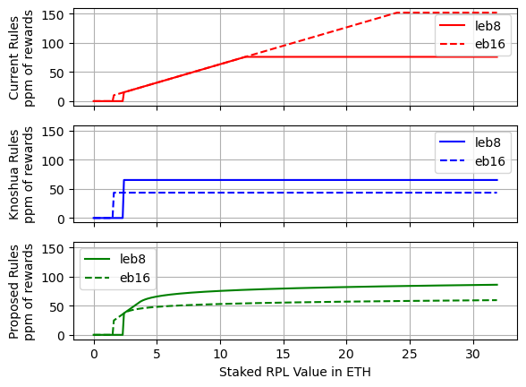
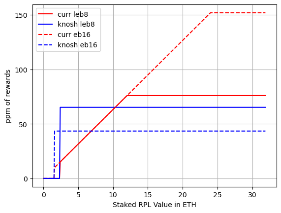
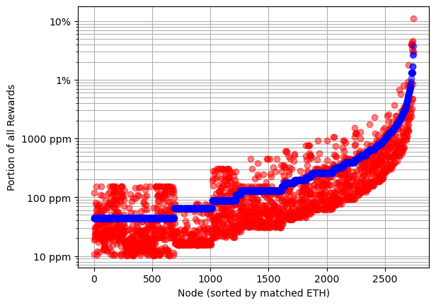
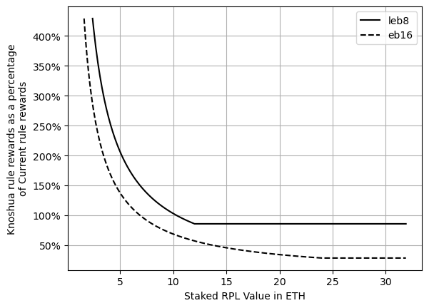
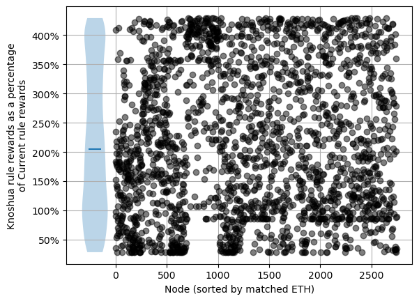
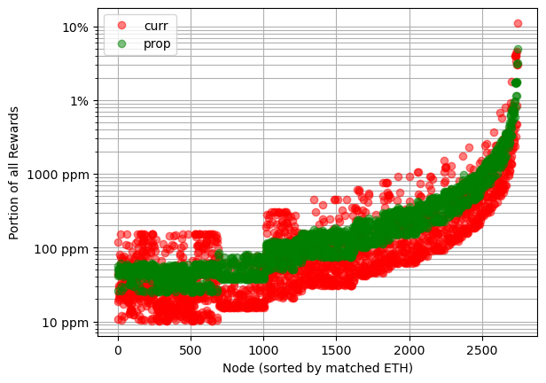
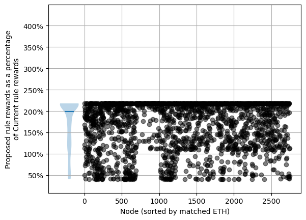
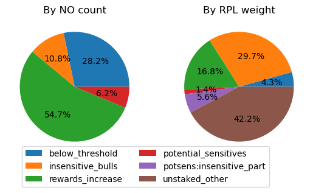
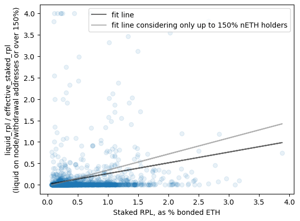

# [DRAFT] RPL Staking Analysis and Initial Suggestion
July 2023

## High level RPL-staking options

### [DRAFT] Visualized rule sets

### [DRAFT] Current rules

- "Minimum" RPL stake is 10% of borrowed ETH (aka protocol ETH, pETH, matched ETH)
  - You must be over this threshold _including_ a new minipool to launch a new minipool
  - You must be over this threshold at rewards snapshot time to be eligible for RPL rewards
- Maximum effective RPL stake is 150% of bonded ETH (aka NO ETH, nETH, provided ETH)
  - Up to this much RPL at rewards snapshot time can be eligible for RPL rewards
- The NO share of inflation gets split up per-effective-RPL

### [DRAFT] "Knoshua" rules
- "Minimum" RPL stake is 10% of borrowed ETH (aka protocol ETH, pETH, matched ETH)
  - You must be over this threshold _including_ a new minipool to launch a new minipool
  - You must be over this threshold at rewards snapshot time to be eligible for RPL rewards
- Only the minimum is "effective".
- If you're below 10% of borrowed ETH, you get no rewards
- The NO share of inflation gets split up per-effective-RPL

### [DRAFT] Proposed rules
- "Minimum" RPL stake is 10% of borrowed ETH (aka protocol ETH, pETH, matched ETH)
  - You must be over this threshold _including_ a new minipool to launch a new minipool
  - You must be over this threshold at rewards snapshot time to be eligible for RPL rewards
- Rewards are based on weight
  - If you're below 10% borrowed ETH, weight is 0
  - From 10%-15% borrowed ETH, weight is linear with the amount of borrowed ETH
  - Above 15%, weight follows a logarithmic curve, rising forever, but ever-more-slowly
- The NO share of inflation gets split up as weight/total_summed_weight

## The proposed plan
- Take up the "Proposed rules" above in order to:
  - Reward primarily based on borrowed ETH, as this is what allows RP to meet rETH demand
  - Discourage large-scale speculation while getting RPL yield from the protocol
    - Encourages speculative holdings either exposed to inflation, or active in defi
  - Keep active rebalancing for good performance minimal. Importantly, there should be essentially
    no downside to being slightly above the minimum (including opportunity cost)
  - The rules will apply to all validators including new ones and currently running ones.
- Move the minimum to withdraw to 15% borrowed ETH (the end of the linear region)
  - This minimizes how "locked" users are, while also acknowledging that RPL is highly volatile; we
    don't want to encourage users to end up below the "minimum" used to start a minipool
- Change the time lock to add withdrawal friction
  - Make withdrawal a 2-step process. Set X RPL to "withdrawing"; these RPL are no longer eligible
    for rewards or voting. After a time period (make a settings; start it at 28 days), the RPL may
    be withdrawn.
  - There were worries that allowing withdrawal to lower thresholds would cause a lot of RPL to be
    withdrawn. While that can happen today, it has a lot of organic friction from exiting minipools
    and recreating them -- its worth noting that (A) RP doesn't control the exit/entrance queues,
    (B) RP doesn't control gas prices, and (C) while people are exiting/entering they are not
    earning rewards for themselves or rETH. The proposed lock time allows us to control the amount
    of friction entirely. This sort of system is very common in Cosmos staking.
  - Get rid of the cooldown on stake. Allow stake-on-behalf without limitations.
  - There has been talk about tracking stake at all times instead of just at the snapshot time; I
    believe this would be extremely challenging in a post-oDAO world, and we should be designing
    with that in mind
- Phase in the new rules slowly
  - For rewards, this can be achieved by calculating the "share of the pie" for both rule sets, and
    then adding them together in a changing proportion.
    - Period X after the vote: `0.17*x*proposed_share + 0.17*(6-x)*current_share`  
    - After period 5, simply used proposed_share
  - For the withdrawal threshold, it's a little complicated. First, it requires a pDAO guardian
    action, so we don't want to do a ton of changes. Second, the current setting is based off of
    bonded ETH, _not_ borrowed ETH. This means 16-ETH minipool holders will have a higher withdrawal
    threshold than intended. Still, it will be much lower than the current one (less than a third).
    - After Period X=3 rewards go out, set withdrawal threshold to 100% bonded ETH
    - After Period X=6 rewards go out, set withdrawal threshold to 45% bonded ETH
      - This is equivalent to the desired 15% borrowed ETH for LEB8s; unfortunately, it's 45%
        borrowed ETH for 16-ETH minipools, but that's the best we can do without a SC change
    - In the next planned Smart Contract release, update to be based on borrowed ETH
      - Once active, set withdrawal threshold to 15% borrowed ETH
- Don't impact voting -- keep that using 0.5*sqrt(min(rpl, 150%_bonded_eth_value_in_rpl))
  - Not taking a position on whether this should change, but if that's desired it can be an
    independent proposal

## A more detailed comparisons between rule sets

### [DRAFT] Current vs Knoshua
|      |      |
|:--------------------------------:|:-----------------------------------:|
|  |  |

- When providing the same amount of rETH supply (aka, at one point on the x axis), the current rules
  have a massive variation in RPL rewards of up to 15x based on the amount of RPL staked. Knoshua's
  rules have zero variation.
- Knoshua's plan _strongly_ favors people that are RPL-hesitant and want to join with low exposure.
  For folks at the minimum, they'd see their rewards ~4.3x
  - This also makes it easier to attract new NOs since the higher rewards can defray the up-front
    RPL price risk
- Knoshua's plan would see the median current NO get ~2x the rewards of the current plan
  - A fair number of NOs end up lower than current rewards.
- Knoshua's plan strongly favors LEB8s. This aligns RPL rewards to what helps the protocol (the
  ability to meet rETH demand).

### [TODO] Current vs Proposed
|      |      |
|:--------------------------------:|:-----------------------------------:|
|  |  |

- When providing the same amount of rETH supply (aka, at one point on the x axis), the current rules
  have a massive variation in RPL rewards of up to 15x based on the amount of RPL staked. For the
  proposed rules, that variation is down to ~3x (technically, the log gains continue indefinitely
  but with aggressively lowering marginal benefit; here I used 12 ETH worth of RPL staked on an LEB8
  as a realistic "limit")
- The proposed plan _strongly_ favors people that are RPL-hesitant and want to join with low
  exposure. For folks at the minimum, they'd see their rewards ~2.44x
  - This also makes it easier to attract new NOs since the higher rewards can defray the up-front
    RPL price risk
- The proposed plan would see the median current NO get over 2x the rewards of the current plan
  - Very few NOs would see a decrease in their rewards (only 16-ETH minipool holders with more than
    8.1 ETH of RPL staked per 16-ETH minipool)
- The proposed plan strongly favors LEB8s. This aligns RPL rewards to what helps the protocol (the
  ability to meet rETH demand).

### Try it out!
There's a calculator you can use to see the share received by a node at
https://www.desmos.com/calculator/o71k2vz1qt

It takes in the number of LEB8s, the number of EB16s, and the amount of RPL staked (in ETH).
It returns out how many millionths of the total reward you'd get under each system, assuming the
current allocations; the higher this number is, the more the node will earn. Note, no graph is
expected -- the results are the ppm numbers on lines 10, 12, and 14.

## Brass Tacks

### Expanded Rationale
This is touched on some in [the proposed plan](#the-proposed-plan) section, but it's worth giving a
bit more space. Funds should be used to achieve protocol goals - ie, they should be used to convince
people to do the things that benefit RP.

- We are spending money badly 
  - Having a lot of bonded RPL on a node is no better for the protocol than a bond near the minimum
  - We currently spend 55.2% of rewards on stake beyond 30% pETH (see `heavy_spend()` in
    `rewards_plot.py`). We had a lot of complaints about oDAO spend (15% of inflation). This is 35%
    of inflation.
  - RPL-as-collateral: any collateral use case _must_ work with the minimum
    - For MEV, attackers aren't likely to put up more than is required
    - For correlated slashing, RPL liquidity won't allow effective liquidation of even the minimum,
      let alone additional RPL beyond the minimum.
  - "Protected speculation" is a term I once used for the "benefit" of RPL rewards at high node
    collateral. Our system of inflation is opinionated and does _not_ reward speculation outside the
    protocol; I don't see a benefit to reward it within the protocol either, as it doesn't achieve
    protocol goals.
  - Note: Some amount of RPL beyond the minimum is a convenience -- a buffer so the NO doesn't need
    to be highly active. We should keep that if possible, as the proposed plan aims to.
    
- We need the ability to meet rETH demand
  - We should scale rewards on pETH, which is directly related to meeting rETH demand.
    - This implies we'll favor LEB8s over EB16s because they more efficiently meet rETH demand.

### Which NOs are sensitive to RPL yield?
I'll separate current NOs (grouped by withdrawal address) into 4 distinct groups:
- Below threshold -- these folks are below the threshold under both systems
- Insensitive bulls -- these folks hold significant RPL at 0% yield
  - Defined as holding at least 5% nETH of RPL liquid on their node/withdrawal wallets
    - This includes RPL over 150% bonded ETH, as it can be immediately withdrawn
  - Note: I'm undercounting these. People can and do hold RPL in wallets other than node and
    withdrawal address, which are the only places I look
- Rewards increase -- these folks are incentivized more with the proposal
- Potential sensitives -- these are the folks where we need to analyze how the proposal will affect
  their strategies going forward; anyone that doesn't fit into the categories above

There's a 4th group which is potential sensitives that have chosen _not_ to participate under the
current ruleset. For them the analysis is simple -- RPL yield will increase ~2.4x for minimum
minipools, which should make them more attractive and nudge people on the edge. No good way to get
this number imo.

I'll separate RPL along similar lines with two differences:
- The potential insensitives have 2 types of RPL
  - Assume the user swaps RPL to make LEB8s, until at some point they have better RPL rewards per
    RPL than they currently do. Since they currently accept their current RPL, we know they are not
    sensitive beyond this point. It's possible they are insensitive sooner, but this is the bright
    line we can draw with confidence
  - We use that bright line to split into a sensitive and insensitive part of the RPL holdings
- RPL holders outside the system are included, who can't be counted in an NO chart

By count, the number of people that are potentially sensitive is modest (under 10%). By RPL weight,
we see that at _most_ 2.8% of RPL is potentially sensitive to this RPL apr change.

I don't think we have a great way to get insight into what the minimum RPL apr needed for the
potential_sensitives is -- any number from 0-100% of current aligns with their visible actions.
That said, there's almost certainly a spread in that range. Purely on intuition, I'd expect in the
50-75% range, which would be 1.4-2% of RPL in the sensitive range respectively.

### RPL Value for potential sensitives
Some people have mentioned fears of this proposal causing a sell-off from RPL-heavy folks.
I don't see this at all. This proposal better aligns incentives and is a win for everyone.

See [the full model here](model_yield_and_appreciation.md) -- I've removed it from here as I don't
think it was communicating effectively, and I've replaced most of it with the above.

I do want to bring in a few outcomes:
- Users that might swap rationally believe RPL ratio trajectory is from 0.93x to 1.16x per year
  - Fairly neutral with some "mildly bullish"
  - For context if that pace kept up 3 years, RPL would be at 80%/156% the current ratio
- The current ruleset has "brakes" around 150%
  - Down brakes - happy: if you're barely interested in selling to make new LEB8s at 151% you will
    stop selling at 150% as you will no longer be activating new RPL yield
  - Up brakes - sad: If you're barely interested in holding at 149%, you will sell over 150% as that
    RPL carries no yield

#### Conclusions
We can now better define the maximum possible RPL rationally sold as:
- Held by potential sensitives from the [NO pie chart](#which-nos-are-sensitive-to-rpl-yield)
  - Currently above 10% borrowed ETH, currently below 150% bonded ETH, not holding a lot of liquid RPL
- Believe RPL trajectory is roughly neutral to mildly bullish 
- In the 2.8% potential sensitive slice from the [RPL weighted pie chart](#which-nos-are-sensitive-to-rpl-yield)
- This currently represents a worst case of just over 17k ETH (~$33M)

Trying to guess at "expected" instead of worst case:
- Maybe 1.4-2% of RPL would be interested in selling - let's take the average 1.7% 
  - 5.6k ETH, or ~$10.7M
- There would be new buying from folks on the low end
  - High APR incentivizes topping off
    - Currently, we'd need about 1350 ETH, or $2.6M to top everyone off
  - High APR incentivizes new joiners
    - This is a wild card that is hard to estimate
    - 2000 attracted minimum LEB8s would put us at even buy and sell pressure
    - Let's guess 500 LEB8s entering at 12% = 1440 ETH, or $2.7M
- There may be new buying due to increased trust from alignment
  - This is likely a small effect from some existing NOs -- it takes involvement to even notice this
- If this is right, we'd be looking at 2.8k ETH of sell pressure (about $5.3M) over the 6 month
  transition period.

### Liquid RPL trends
As a sanity check, we can look into our expectation that RPL-heavy NOs tend to value APR less by
looking into trends in liquid RPL holdings. Liquid RPL gets _zero_ yield, so people that hold
significant amounts aren't terribly sensitive to that yield. Note that for the plot
(but not the fit line) I've clipped y values to 4.0 to make the chart legible.

We see exactly the expected trend. More staked RPL tends to go along with more bullish (higher
expectations of RPL price appreciation), which tends to go with less sensitivity to RPL APR and a
higher willingness to hold liquid RPL (no yield).

### [DRAFT] Why change? People entered with this ruleset.

I believe consistency is important. We shouldn't change things just because we can. That said, I
also don't believe we should totally shackle ourselves forever based on past decisions.

Let's start with another question -- where does the current ruleset come from?
- The minimum
  - Initial design by fireeyes -- no insight into reasoning
  - Often used in RPL price models to set the fundamental floor value of RPL 
  - When we added LEB8s, we wanted to keep the fundamental floor value in those models unchanged,
    which is why we went with keeping it constant as a percent of borrowed ETH
- The maximum
  - Initial design by fireeyes -- no insight into reasoning [?? IS THIS RIGHT?]
  - There was a rather stressful vote when adding LEB8s about whether the maximum should be 150% of
    borrowed ETH, 150% of bonded ETH, or flat per minipool
  - During that vote, there were attempts to justify the original 150% number for 16-ETH (so that 
    we could better understand what it meant to minimize change). The best reason I saw was that it
    served as "protected speculation" for heavily RPL-aligned individuals.
  - There was an interaction with the minimum threshold to withdraw until Redstone. It was possible
    to instantly stake RPL and have that affect rewards, so if people could withdraw at will, they
    could get all the benefits of max stake while only having the RPL staked for a moment. [?? IS 
    THIS RIGHT? DID WE HAVE THE TIMELOCK BEFORE REDSTONE?]
- Keeping the rules the same
  - All else being equal, stability is good
  - Right now we're rewarding speculating within the protocol, rather than creating rETH supply
    - This is _not_ aligned with the protocol's needs, which is a suitably important reason to make
      changes.
  - Now that we're post-Shapella, people can exit if the rules truly don't suit them. This makes it
    less critical to keep things exactly the same